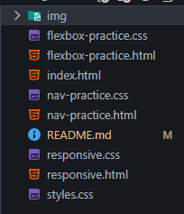

# Лабораторная работа №9. Адаптивная верстка

## Цель работы
Изучение принципов адаптивной верстки и медиа-запросов. Создание адаптивной веб-страницы.

## Структура проекта

## Описание
В ходе выполнения лабораторной работы была создана адаптивная веб-страница с использованием современных технологий верстки.
В процессе работы были выполнены несколько вариаций визуала сайтов, в которых использовались разные технологии.

## Автор
Ханов В.В.
ИСП-231
